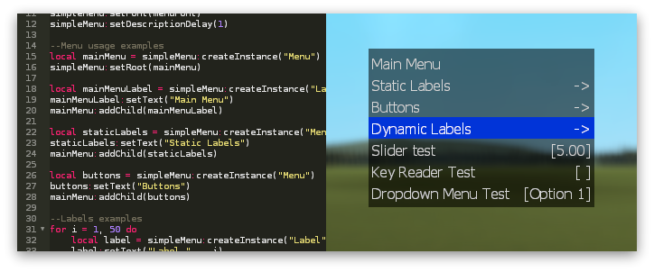

<h3 align="center">
Simple menu library for StarfallEx
<br>

</h3>

A single-file [StarfallEx](https://github.com/thegrb93/StarfallEx) library for
building clientside menus to control your contraptions.

Menus can be interacted with using keyboard, mouse, and controller (XInput).
The library currently provides labels, buttons, sliders, key readers, and
dropdowns.

Code used in the screenshot above is available here: [`sample.lua`](sample.lua).

## Installation and usage

Place [`sf-simplemenu.lua`](sf-simplemenu.lua) in your Starfall scripts folder,
for example `garrysmod/data/starfall/`. Since this is a library, placing it in
a subfolder such as `/libs/` is recommended.

Include it in your Starfall script:

```lua
--@include libs/sf-simplemenu.lua
local simpleMenu = require("libs/sf-simplemenu.lua")
```

Build your menu, enable the Starfall HUD component, and then open the menu:

```lua
simpleMenu:Open(true, true)
```

Widgets can be added to menus using
`simpleMenu:createInstance("<widget class name>")`.

## Widgets

| Class name | Description |
| --- | --- |
| `Widget` | Base class for all widgets. It can be placed in a menu but has no behavior or appearance. |
| `Label` | A text label. |
| `Menu` | A nested menu element that can contain child widgets. |
| `Button` | A button element that can invoke functions on press and release. |
| `Slider` | A slider element for adjusting numeric values. |
| `KeyReader` | An input field for storing keybinds. |
| `XinputKeyReader` | An input field for storing XInput keybinds. Requires the XInput library to be installed by the player. |
| `Dropdown` | A dropdown element for choosing from a set of options. |

Documentation is still incomplete. For more details, see the source in
[`sf-simplemenu.lua`](sf-simplemenu.lua) and the usage example in
[`sample.lua`](sample.lua).
